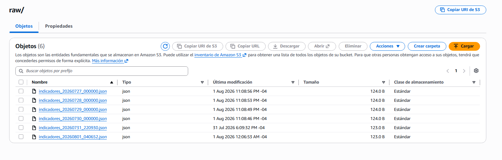
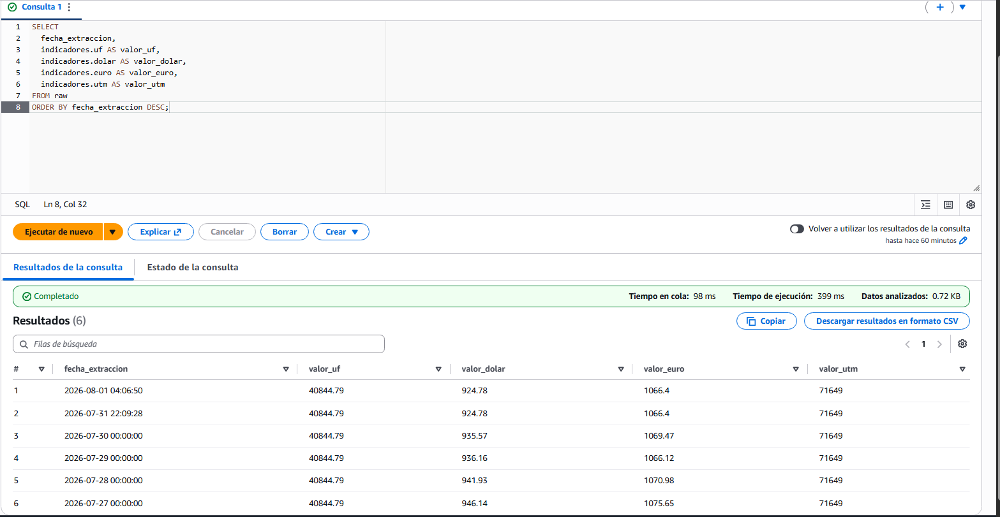

# Pipeline de Indicadores Económicos de Chile — AWS

Pipeline serverless en AWS para la ingesta, almacenamiento y consulta de indicadores económicos históricos de Chile (UF, Dólar, Euro, UTM).

## Arquitectura

API pública (mindicador.cl) → AWS Lambda → Amazon S3 (raw) → AWS Glue Crawler → AWS Glue Data Catalog → Amazon Athena (consulta SQL)

## Herramientas utilizadas

- **AWS Lambda**: extracción de datos vía API, ejecutando lógica de ingesta serverless
- **Amazon S3**: almacenamiento de datos crudos en formato JSON
- **AWS Glue Crawler**: inferencia automática de esquema y catalogación
- **Amazon Athena**: consultas SQL serverless directamente sobre S3

## Qué hace el pipeline

1. **Extracción**: una función Lambda en Python consulta la API pública de mindicador.cl para 4 indicadores (UF, Dólar, Euro, UTM) en fechas históricas específicas, manejando casos sin datos (fines de semana) y respetando límites de la API con pausas entre solicitudes.

2. **Almacenamiento**: los datos se guardan como archivos JSON individuales por fecha en un bucket S3.



3. **Catalogación**: un Glue Crawler escanea el bucket e infiere automáticamente el esquema, generando una tabla consultable en el Data Catalog.

4. **Consulta**: Amazon Athena permite ejecutar SQL directamente sobre los datos en S3 sin necesidad de una base de datos tradicional.



```sql
SELECT 
  fecha_extraccion,
  indicadores.uf AS valor_uf,
  indicadores.dolar AS valor_dolar,
  indicadores.euro AS valor_euro,
  indicadores.utm AS valor_utm
FROM raw
ORDER BY fecha_extraccion DESC;
```

## Hallazgo técnico

Durante el desarrollo, se verificó mediante las pruebas de ejecución (Test) en la consola de AWS Lambda que el valor de la UF se mantuvo constante en el rango de fechas consultado. Inicialmente se sospechó un error de código, pero al revisar la salida de la función se confirmó que la API devolvía correctamente el histórico solicitado; la UF simplemente no varió en ese período corto. También se confirmó que la UTM es un valor mensual (la API devuelve el mismo valor para todo el mes).

## Notas técnicas

- La API de mindicador.cl requiere una solicitud separada por cada indicador y fecha específica.
- Amazon Athena permite explorar los datos sin necesidad de una base de datos gestionada, ideal para volúmenes pequeños/medios de consulta ocasional.

## Autor

Jorge Luis Rebaza Micha — [LinkedIn](https://linkedin.com/in/jorge-luis-rebaza/)
